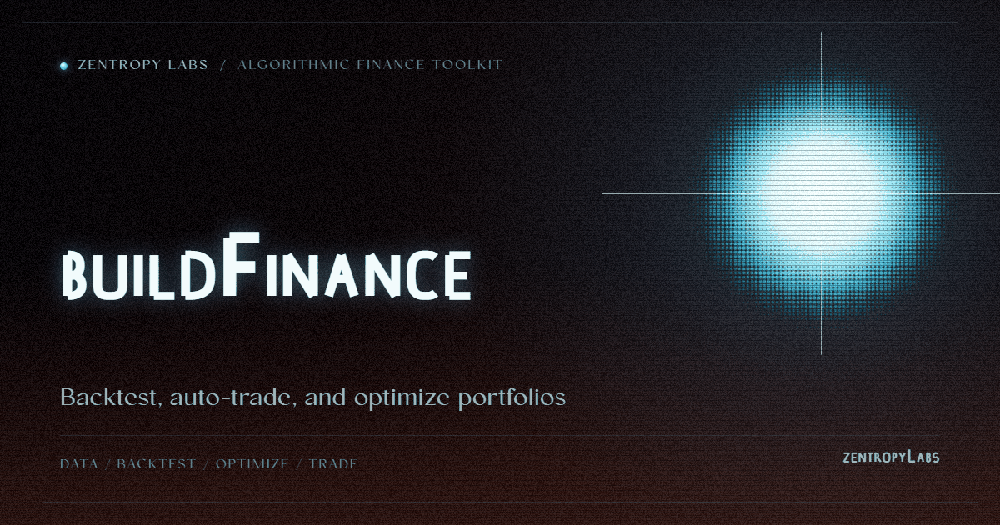

<p align="center">
  
</p>
<!-- Project mark: docs/brand/build-finance-mark.svg -->

# Build Finance

> Python algorithmic trading toolkit for technical indicators, strategy backtesting, risk metrics, portfolio optimization, position sizing, and paper/live broker execution.

[Project Telos](https://harperz9.github.io) | [gather](https://github.com/HarperZ9/gather) | [crucible](https://github.com/HarperZ9/crucible) | [index](https://github.com/HarperZ9/index) | [forum](https://github.com/HarperZ9/forum) | [telos](https://github.com/HarperZ9/telos) | [emet](https://github.com/HarperZ9/emet) | [buildlang](https://github.com/HarperZ9/buildlang)

[](https://github.com/HarperZ9/build-finance/actions/workflows/ci.yml)


[](LICENSE)

> **Money-adjacent software.** Paper trading is the default; live broker
> execution is explicit opt-in; the library custodies no funds. Read
> [SECURITY.md](SECURITY.md) before connecting a real broker account.

Algorithmic trading toolkit for stocks and crypto. Backtest strategies, run
paper-trading loops, optimize portfolios, and integrate broker execution only
when explicitly configured.

## Quick Start

Install the current GitHub release wheel, verify its checksum, and check the
CLI entrypoint:

```powershell
& {
  $ErrorActionPreference = 'Stop'
  $wheel = 'build_finance-1.0.1-py3-none-any.whl'
  $expected = '6597fbbbc13d26cb63a1c123a929a21e512fefb19d156c9d2786364108b3b515'
  Invoke-WebRequest `
    -Uri "https://github.com/HarperZ9/build-finance/releases/download/v1.0.1/$wheel" `
    -OutFile $wheel
  $actual = (Get-FileHash ".\$wheel" -Algorithm SHA256).Hash.ToLower()
  if ($actual -ne $expected) {
    throw "SHA-256 mismatch for $wheel. Expected $expected, got $actual."
  }
  python -m pip install ".\$wheel"
  build-finance --help
}
```

In other shells, download the wheel, compare its SHA-256 to the expected value
above, and install it only if the digest matches.

The 1.0.1 release is published on GitHub at
<https://github.com/HarperZ9/build-finance/releases/tag/v1.0.1>. PyPI
publication is not documented for 1.0.1.

For source development, clone the repository before using editable installs:

```bash
git clone https://github.com/HarperZ9/build-finance.git
cd build-finance
git checkout v1.0.1
python -m pip install -e .
build-finance --help
```

Add the optional GUI extras from a checkout when you need the PyQt6 interface:

```bash
python -m pip install -e ".[gui]"
build-finance gui
```

Use paper trading and generated sample data until you intentionally configure
broker credentials. No quickstart command places live orders.

After installing, use the CLI:

```bash
build-finance backtest --strategy momentum --days 252
build-finance optimize --method max_sharpe
build-finance indicators
```

## Features

### Trading Strategies (5)
- **Momentum** — EMA crossover + RSI filter
- **Mean Reversion** — Bollinger Band bounce
- **Trend Following** — MA crossover + ATR stops
- **Breakout** — N-period high/low with volume confirmation
- **Ensemble** — Weighted combination of all four (default)

### Technical Indicators (10)
SMA, EMA, RSI, MACD, Bollinger Bands, ATR, Stochastic, VWAP, ADX, OBV — all vectorized with numpy.

### Risk Metrics (14)
Sharpe, Sortino, Max Drawdown, Calmar, VaR (parametric + historical), CVaR, Beta, Alpha, Information Ratio, Volatility, Profit Factor, Win Rate.

### Backtesting Engine
- Event-driven simulation with slippage, commission, and market impact
- Walk-forward optimization
- Monte Carlo simulation (trade-order shuffling)
- Equity curve tracking with drawdown analysis

### Portfolio Optimization
- Mean-Variance (Markowitz) — max Sharpe, min variance, max return
- Black-Litterman — combine market equilibrium with investor views
- Hierarchical Risk Parity (HRP) — correlation-based clustering
- Risk Parity — equal risk contribution

### Auto-Trading
- Paper trading (simulated, no real money)
- Alpaca API (paper + live, stocks)
- Yahoo Finance data (stocks, free)
- CoinGecko data (crypto, free)
- Configurable: symbols, strategy, interval, risk per trade, max positions
- Runs both stocks and crypto simultaneously

### Market Data
- Yahoo Finance — real-time and historical (no API key)
- CoinGecko — crypto OHLC (no API key)
- CSV import/export (Yahoo, TradingView, generic)
- Synthetic data generation for testing

## GUI

Professional interface matching Calibrate Pro's design:

- **Dashboard** — Account overview, quick actions, recent activity
- **Backtest** — Run strategies with equity curve visualization and trade log
- **Auto-Trader** — Start/stop the configured trading loop with real-time status and activity log
- **Portfolio** — Optimize weights with visual allocation bars
- **Market Data** — Fetch and visualize price charts
- **Settings** — Broker API keys, default parameters

## CLI Commands

| Command | Description |
|---------|-------------|
| `build-finance` | Launch GUI (default) |
| `build-finance backtest` | Run backtest with strategy selection |
| `build-finance analyze` | Analyze trades from CSV |
| `build-finance optimize` | Portfolio optimization |
| `build-finance indicators` | Compute technical indicators |
| `build-finance gui` | Launch GUI explicitly |

## Architecture

```
build_finance/
  data.py          Market data structures (Candle, Quote, Signal, Trade, Position)
  indicators.py    10 vectorized technical indicators
  strategies.py    5 trading strategies
  risk.py          14 risk metrics
  sizing.py        5 position sizing methods
  orderbook.py     Order execution simulation
  backtest.py      Backtesting engine (walk-forward, Monte Carlo)
  portfolio.py     Portfolio optimization (MV, BL, HRP, RP)
  market_data.py   Yahoo Finance, CoinGecko, CSV I/O
  broker.py        Paper trading + Alpaca API
  autotrader.py    Automated trading engine
  cli.py           Command-line interface
  gui/             PyQt6 professional interface (6 pages)
```

## License

Build Finance is released under the FSL-1.1-MIT.
The source is available so you can read it, run it, and build on it; commercial use
that competes with the project is reserved to the Licensor. See [LICENSE](LICENSE).

Copyright (c) 2022-2026 Zain Dana Harper. All rights reserved.

---

**[Zentropy Labs](https://github.com/ZentropyLabs-ai)** · order out of entropy. An independent lab building evidence-first tools that leave a re-checkable artifact behind. Built by Zain Dana Harper in Seattle. The full workbench is at [Project Telos](https://harperz9.github.io).
